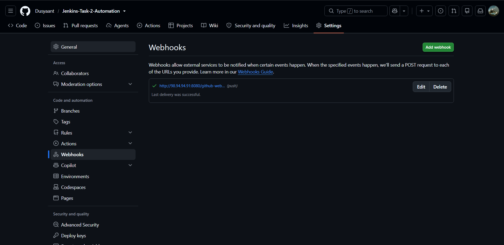
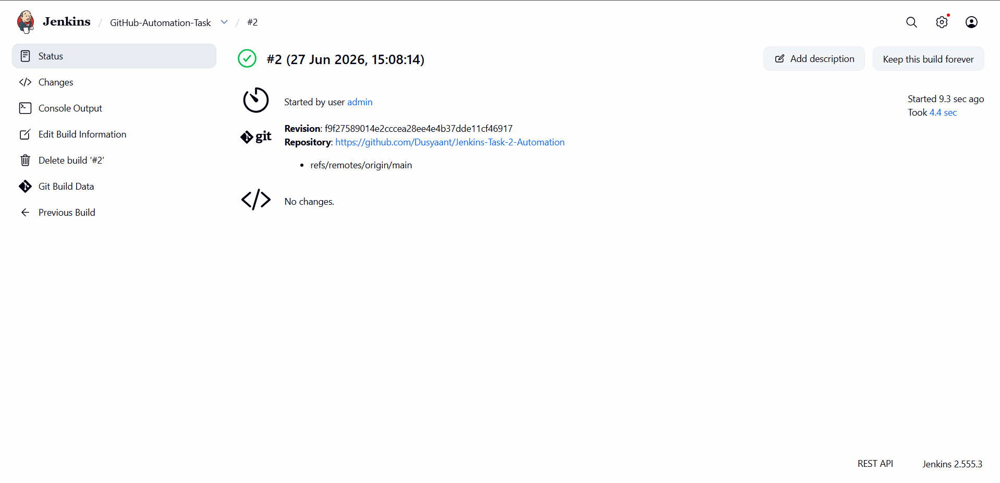
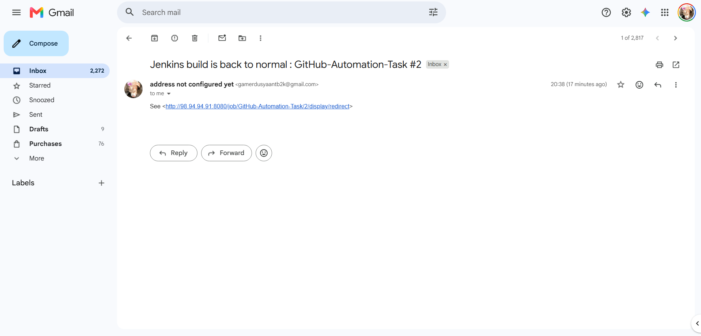

# Jenkins-Task-2-Automation

This repository demonstrates a fully automated Continuous Integration (CI) pipeline using Jenkins and GitHub Webhooks. The project triggers an automated build and testing sequence via a shell script whenever changes are pushed to the repository, concluding with automated email notifications.

## 📂 Repository Contents

* **`build_test.sh`**: The core shell script executed by Jenkins during the build phase to run tests and validate the environment.
* **`BUILD_LOG_OUTPUT.txt`**: The exported console output from Jenkins, verifying the successful execution of the pipeline.
* **`01_Jenkins_Build_Success.png`**: Visual proof of the successful Jenkins build execution.
* **`02_GitHub_Webhook_Active.png`**: Configuration of the active GitHub Webhook used to trigger the pipeline.
* **`03_Jenkins_Email_Notification.png`**: Verification of the post-build email notification sent by Jenkins.

## ⚙️ Pipeline Workflow

1.  **Source Code Management (SCM):** The Jenkins job is linked to this GitHub repository.
2.  **Webhook Trigger:** A GitHub Webhook is configured to listen for push events. When a commit is pushed, it automatically pings the Jenkins server.
3.  **Build Execution:** Jenkins pulls the latest code and executes the `build_test.sh` script to perform the required automation tasks.
4.  **Post-Build Actions:** * Build logs are generated and recorded.
    * An automated email notification is dispatched to the configured stakeholders detailing the success or failure of the build.

## 📸 Project Evidence

### 1. GitHub Webhook Configuration
*(Webhook successfully triggering the Jenkins environment)*

### 2. Jenkins Build Success
*(Successful execution of the Jenkins Job)*

### 3. Automated Email Notification
*(Email dispatched post-build to notify stakeholders)*

---
*Developed as part of Jenkins Automation Task 2.*
